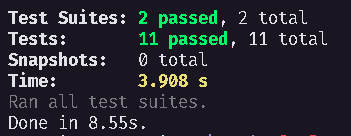

<h1 align="center">
TodoAPI - Desafio 01 Concluido
</h1>

## 💫 Sobre o desafio
Nesse desafio, você deverá criar uma aplicação para treinar o que aprendeu até agora no Node.js!

Essa será uma aplicação para gerenciar tarefas (em inglês *todos*). Será permitida a criação de um usuário com `name` e `username`, bem como fazer o CRUD de *todos*:

- Criar um novo *todo*;
- Listar todos os *todos*;
- Alterar o `title` e `deadline` de um *todo* existente;
- Marcar um *todo* como feito;
- Excluir um *todo*;

Tudo isso para cada usuário em específico (o `username` será passado pelo header).

## ✅ Testes

## 🚀 Tecnologias 

## 📝 Requisitos

- [x] Deve ser possível criar uma conta para os usuários
- [x] Deve ser possível fazer a listagem de todas as tarefas do usuário
- [x] Deve ser possível criar uma nova tarefa para o usuário
- [x] Deve ser possível fazer a atualização de uma tarefa do usuário
- [x] Deve ser possível marca como finalizado a tarefa do usuário
- [x] Deve ser possível fazer a exclusão de uma tarefa

## 📝 Regras de negócio

- [x] Não deve ser possível fazer a atualização da tarefa sem um usuário existente
- [x] Não deve ser possível excluir uma tarefa de um usuário não existente

---
